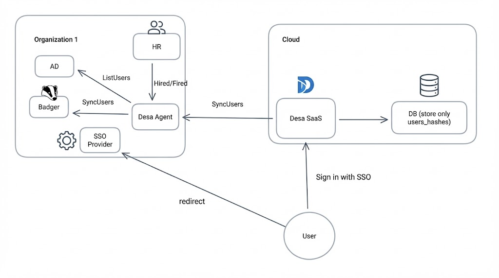

### How it works

1. **On-premise deployment** — Desa Agent runs within your infrastructure, giving you full control over PII data management and compliance.
2. **Zero PII in the cloud** — Desa SaaS connects to your agent to display user information in the UI, but no personally identifiable data is ever stored on our servers.  